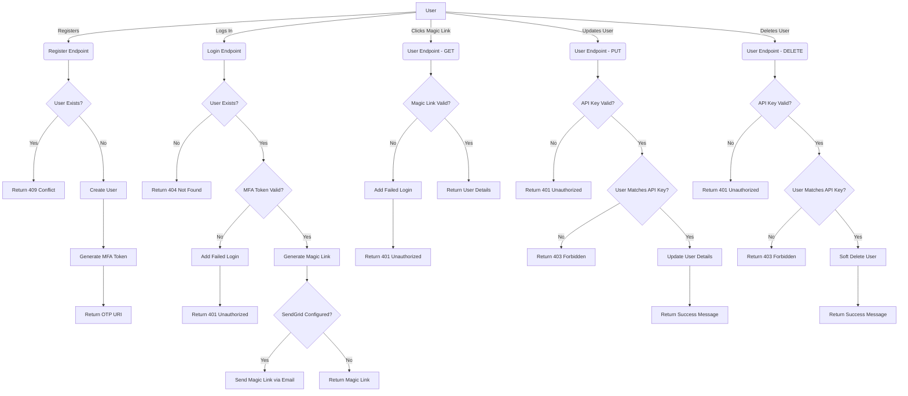

# MagicalAuth

MagicalAuth is a simple but magical authentication system for Python applications. It is designed to be easy to use and easy to understand. It is also designed to be secure and reliable utilizing magic links and multi-factor authentication.

## Project Purpose

This repository serves as a boilerplate for building FastAPI applications with a secure authentication system. It provides a solid foundation for developers to kickstart their projects, saving time and effort in setting up the basic structure and authentication functionality.

The main purpose of this project is to offer a template that includes essential components such as authentication, database integration, API endpoints, and a user interface. By leveraging this boilerplate code, developers can focus on building the core functionality of their applications while benefiting from the pre-built features and best practices.

## Tech Stack

This project utilizes the following technologies and frameworks:

- **Python**: The primary programming language used for developing the application.
- **FastAPI**: A modern and high-performance web framework for building APIs in Python. It offers automatic API documentation, request validation, and serialization.
- **SQLAlchemy**: A powerful SQL toolkit and Object-Relational Mapping (ORM) library for Python. It simplifies database operations and provides a flexible way to interact with various databases.
- **PostgreSQL**: A reliable and feature-rich open-source relational database management system. It serves as the primary database for storing application data.
- **Streamlit**: A Python library for building interactive web applications quickly and easily. It is used to create the user interface for the application.
- **GitHub**: A web-based platform for version control and collaboration. It hosts the project repository and provides features like issue tracking and pull requests.
- **Docker**: A containerization platform that allows packaging the application and its dependencies into a portable container. It ensures a consistent environment across different machines and simplifies deployment.
- **SendGrid**: An email delivery service used for sending magic link emails for authentication.

By leveraging this tech stack, developers can build scalable, secure, and efficient applications while taking advantage of the latest tools and best practices in the Python ecosystem.

## Environment Variables

- `APP_NAME`: The name of the application. This will be used in the magic link email to the user.
- `ALLOWED_DOMAINS`: A comma-separated list of allowed email domains. If this is set, only users with email addresses from these domains will be allowed to register and login. If this is not set, it will default to `*` and all email domains will be allowed.
- `ENCRYPTION_SECRET`: The secret key used to encrypt and decrypt the magic link tokens. This should be a long random string.
- `MAGICALAUTH_SERVER`: The URL of the MagicalAuth server. This should be the URL of the server that is running the MagicalAuth FastAPI service.
- `MAGIC_LINK_URL`: The URL that the magic link will point to. This should be the URL of the application that will handle the magic link. It will send query parameters `email` and `token` to this URL that will be used on the `MAGIC_LINK_URL` endpoint to authenticate the user.
- `SENDGRID_API_KEY`: The API key for SendGrid. This is used to send the magic link email to the user.
- `SENDGRID_FROM_EMAIL`: The email address that the magic link email will be sent from. This should be a verified email address in SendGrid.
- `REGISTRATION_WEBHOOK`: The URL that the registration webhook will be sent to. This should be the URL of the application that will handle the registration webhook. It will send a POST request with a JSON body containing the user's email address.
- `DATABASE_TYPE`: The type of database to use. This should be one of `sqlite`, or `postgresql`.
- `DATABASE_USER`: The username for the database.
- `DATABASE_PASSWORD`: The password for the database.
- `DATABASE_HOST`: The host for the database.
- `DATABASE_PORT`: The port for the database.
- `DATABASE_NAME`: The name of the database.
- `UVICORN_WORKERS`: The number of Uvicorn workers to use. This should be an integer.
- `LOG_LEVEL`: The log level for the application. This should be one of `DEBUG`, `INFO`, `WARNING`, `ERROR`, or `CRITICAL`.

### Environment File Example

Replace the values with your own values and save it as `.env` in the root directory of the project.

```env
APP_NAME=MagicalAuth
ALLOWED_DOMAINS=devxt.com,magicalauth.com
ENCRYPTION_SECRET=supersecretkey
MAGICALAUTH_SERVER=http://localhost:12437
MAGIC_LINK_URL=http://localhost:8519
SENDGRID_API_KEY=SG.x
SENDGRID_FROM_EMAIL=your@email.com
REGISTRATION_WEBHOOK=http://localhost:7437/api/user
DATABASE_TYPE=postgres
DATABASE_USER=postgres
DATABASE_PASSWORD=postgres
DATABASE_HOST=postgres
DATABASE_PORT=5432
DATABASE_NAME=postgres
UVICORN_WORKERS=4
LOG_LEVEL=INFO
```

## Usage

```bash
docker-compose down && docker-compose pull && docker-compose up
```

Access the FastAPI documentation at `http://localhost:12437` .

### Web User Interface

See [UI.py](UI.py) for an example of how to use MagicalAuth in a Streamlit application. It runs with the FastAPI service in the Docker Compose setup.

Access the Streamlit UI at `http://localhost:8519` .

## Folder Structure Explanation

- `.github/workflows`: Contains GitHub Actions workflows for CI/CD.
  - `code_style_check.yml`: Runs a code style check when committing to the GitHub repository.
  - `publish-docker-dev.yml`: Publishes the Docker image to the GitHub Container Registry when a new tag is pushed to the GitHub repository with the branch name or `dev` as the tag. This also runs tests from `tests.ipynb`.
  - `publish-docker.yml`: Publishes the Docker image to the GitHub Container Registry when the main branch is updated. This also runs tests from `tests.ipynb`.
  - `todos.yml`: Runs a TODO check when committing to the GitHub repository and creates GitHub issues for each TODO found if they do not already exist.
- `.streamlit/config.toml`: Streamlit configuration file.
- `components`: Contains Streamlit components used by the Streamlit UI.
  - `Auth.py`: Contains the authentication component with `get_user` and `log_out_button` functions.
- `data`: Contains the persisted database files. Clear contents of this folder to reset the database.
- `endpoints`: Contains the FastAPI endpoints split by purpose.
  - `Auth.py`: Contains the authentication endpoints.
- `.dockerignore`: Specifies files and directories that Docker should ignore when building the image.
- `.env.example`: An example of the `.env` file that should be used for configuration.
- `.gitignore`: Specifies files and directories that Git should ignore when committing.
- `DB.py`: Contains all the database models and initialization of the database. It includes seeding data to the database and running the server. Add more models to create additional database tables or modify the existing user table to add required user fields.
- `docker-compose.yml`: The Docker Compose file used to run the server in its production mode within a Docker container.
- `Dockerfile`: Defines the Docker container for the application.
- `Globals.py`: Contains global variables and a `getenv` function to retrieve environment variables with default values defined within the function for the app.
- `launch.sh`: Used by the Docker container to run the server after it finishes loading.
- `MagicalAuth.py`: Contains the `MagicalAuth` class and functions for authentication.
- `Models.py`: Contains the Pydantic models used by the FastAPI endpoints.
- `README.md`: The file that you are currently reading.
- `requirements.txt`: Contains the Python packages required by the application.
- `Server.py`: The main FastAPI server file.
- `tests.ipynb`: Contains test files for the application.
- `UI.py`: Contains the Streamlit UI for the application.

## Workflow


